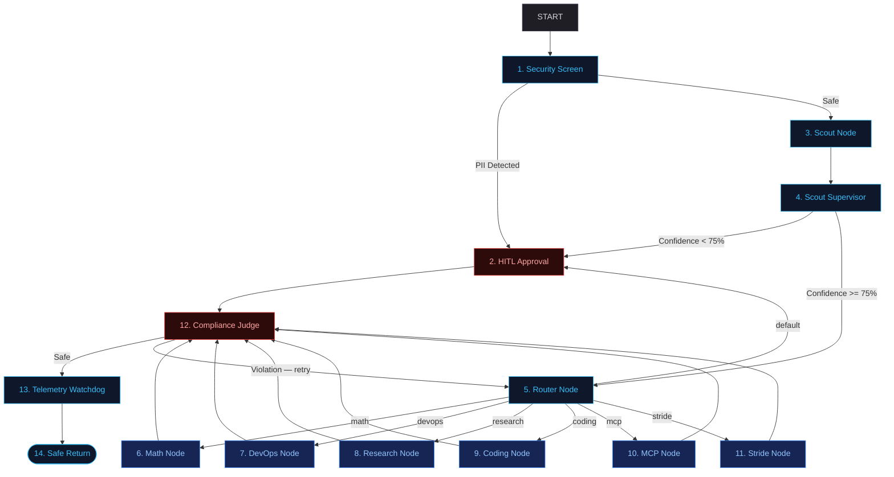
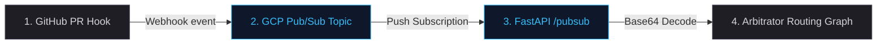

# System Architecture Blueprint
### Graph Topology, Routing Flows, and Active Supervisor Nodes

The Capability Arbitrator is designed around a **Scout-and-Execute** workflow. This blueprint outlines the active nodes, routing edges, and governance controllers that make up our multi-agent network.

---

## 📐 The Progressive Disclosure Pattern

To solve the **Context Rot** crisis (where agents are overloaded with hundreds of irrelevant instructions and tools), our architecture breaks execution into two stages:
1. **Understanding (Intent Classification):** A lightweight, low-latency **Scout** node inspects the user prompt and assigns a capability tag plus a confidence score.
2. **Confidence Check:** A **Scout Supervisor** checks that confidence score. If the Scout is less than 75% sure, the request pauses for human approval instead of guessing.
3. **Execution (Task Solving):** The request is routed to a specialized node. The specific Agent Skill (`SKILL.md`) and tools (such as MCP connections) are loaded into memory *only* at the moment of execution.

---

## 🗺️ System Workflow Diagram

The flowchart below represents the flow of a user transaction through our security, classification, routing, and verification layers:

---

## 📡 Ambient Event-Driven Pipeline

To support background operations (such as automated pull request triage), the system can be triggered ambiently via Google Cloud Pub/Sub:

---

## 🎛️ Node Topology Directory

Our active ADK graph contains fourteen distinct execution and monitoring nodes:

### 1. Inbound Filtration
*   **Security Screen (1):** A pre-LLM regex filtration layer. It intercepts user inputs to check for GDPR-scoped PII (SSNs, emails, phone numbers, credit cards, IP addresses), routing violations immediately to human approval.
*   **HITL Approval (2):** A blocking human-in-the-loop gate utilizing ADK `RequestInput` hooks. It pauses the workflow, alerts the dashboard manager, and waits for a manual override response.

### 2. Intent Classification
*   **Scout Node (3):** Powered by the lightweight `gemini-3.5-flash` model. It is built in [app/app_utils/scout_utils.py](file:///Users/rmcdonald/Repos/agy-cli-projects/capability-arbitrator/app/app_utils/scout_utils.py) and classifies user prompts into capability tags using a structured JSON schema. The schema includes `confidence_score`, which is a 0-100 number showing how sure the Scout is.
*   **Scout Supervisor (4):** Reviews classification confidence metrics in [app/app_utils/scout_supervisor_utils.py](file:///Users/rmcdonald/Repos/agy-cli-projects/capability-arbitrator/app/app_utils/scout_supervisor_utils.py). If the Scout is under 75% confident, the request is escalated to the Approval Node with a short explanation. If the Scout is 75% confident or higher, the request continues to the Router Node.
*   **Router Node (5):** Evaluates the tag and forwards the prompt context along the correct execution edge.

### 3. Specialized Execution Nodes
*   **Math Node (6):** A deterministic execution target built in [app/app_utils/math_node_utils.py](file:///Users/rmcdonald/Repos/agy-cli-projects/capability-arbitrator/app/app_utils/math_node_utils.py). It sends simple arithmetic to Python code, records zero LLM tokens, and returns an exact result.
*   **DevOps Node (7):** A deterministic execution target. It runs local bash commands, tests (via `pytest`), or checkers via subprocesses.
*   **Research Node (8):** A specialized `LlmAgent` loaded with academic literature-searching instructions and few-shot formatting patterns.
*   **Coding Node (9):** An `LlmAgent` bound to an MCP filesystem tool, permitting file generation and refactoring in the local workspace.
*   **MCP Node (10):** A tool-enabled agent focused on filesystem search, file list retrieval, and file index matching.
*   **Stride Node (11):** A security threat modeling agent that maps architectural components to security threats.

### 4. Outbound Quality & Guardrails
*   **Compliance Judge (12):** Think of this like a spell-checker at the exit door. Before any execution output reaches the user, this node reads it and looks for anything that resembles a password, API key, or secret token. It uses a list of well-known secret fingerprints — AWS access keys, GitHub tokens, private key blocks, bearer tokens, and more — and scans the text using pattern matching (regex). If everything looks clean, the output moves on to the Telemetry Watchdog with a **safe** route. If a secret is found, the judge sends the agent back to redo its work with an **auto-heal prompt** that names the exact type of leak and instructs the model to replace all sensitive values with `<REDACTED>`. This node is implemented in [app/app_utils/compliance_judge_utils.py](app/app_utils/compliance_judge_utils.py).

*   **Telemetry Watchdog (13):** Think of this like a helpful monitor that watches how much time and money our agent is spending. At the end of every execution, it checks two conditions:
    1. **Cumulative Session Tokens:** The total words/tokens processed in this chat session. If it exceeds **10,000 tokens**, the context is getting too large.
    2. **Elapsed Duration (Latency):** How long the execution took. If it exceeds **30 seconds**, it is taking too long.
    
    If either budget is exceeded, the watchdog takes two corrective actions:
    - **Context Pruning (Summarizing):** It asks Gemini to summarize the conversation history and replaces the long history with a single concise summary so that subsequent turns don't run out of memory.
    - **Model Switching:** It switches the downstream model configuration to a cheaper/faster model (`gemini-2.0-flash-lite`) for the remainder of the session to save costs.
*   **Safe Return (14):** The normal endpoint after execution, compliance review, and telemetry monitoring. The `OutcomeJudge` also runs in the evaluation layer for offline grading, but the `ComplianceJudge` is the live runtime safety gate wired directly into the ADK graph in [app/agent.py](app/agent.py).

---

## ⚙️ Execution Spectrum: Runtime vs. Evals

To manage a production agentic system, we segment our workloads into four distinct execution environments:

| Spectrum | Stage | Scope | Key Tooling |
| :--- | :--- | :--- | :--- |
| **Runtime Execution** | Production | Real-time user transaction handling, PII filtering, and capability routing | ADK 2.0 Graph, `FastAPI` |
| **CI/CD Gates** | Build-Time | Checks pre-commit/pre-push changes for style limits and code regressions | Git hooks, `agent_quality_check.py` |
| **Runtime Evaluation** | Testing / Validation | Dynamic red-teaming and automated LLM-as-a-judge scorecards | `DeepTester`, `OutcomeJudge` |
| **Development-Only** | Local Iteration | Interactive command-line prompts and playground visualizers | `agents-cli playground` |
