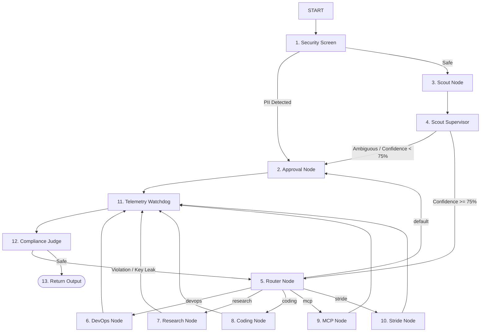

# System Architecture & Workflow Topology

This document details the system design, node relationships, and graph execution paths of the Capability Arbitrator.

---

## 1. Why: Context Rot & Progressive Disclosure

Traditional multi-agent systems suffer from **"Context Rot"**—they try to load every tool, instruction, and system file into the model's active memory upfront. 

The Capability Arbitrator utilizes a **Scout-and-Execute** pattern with **Progressive Disclosure**:
1. A fast, low-cost **Scout** node first determines what capability the user prompt needs (e.g. coding, research).
2. The orchestrator routes the request and loads *only* the specific system prompt (Agent Skill) and tools (like an MCP filesystem tool) needed for that single task, keeping the model's context window clean and preserving its reasoning budget.

---

## 2. What: The Execution Spectrum

To keep our system robust, we separate operations into four distinct layers:

### A. Runtime Execution (Production)
The live path that processes user requests. It intercepts inputs via the **Security Screen**, routes them via the **Scout Node**, and monitors outputs through **Watchdog/Judge** nodes.

### B. CI/CD Gates (Build-Time)
Static and dynamic checks executed during development and Git pushing. This blocks malformed python code or non-compliant document structures before changes are merged.
* *Example:* Pre-push hooks running `agent_quality_check.py` and unit/integration tests.

### C. Runtime Evaluation (Validation Evals)
Continuous offline evaluation loops. The system generates dynamic red-teaming tasks and grades them using LLM-as-a-judge scorecards to mathematically measure routing precision and resource savings.
* *Example:* `test_deep_testing.py` running the `DeepTester` -> `OutcomeJudge` loop.

### D. Development-Only (Local Debugging)
Tools used by developers to iterate on prompts and test node connectivity.
* *Example:* `agents-cli playground` and the local developer console.

---

## 3. How: Graph Topology & Node Guide

The execution graph contains thirteen distinct logical nodes:

### Node Explanations:

1. **Security Screen:** Scans user inputs using regex patterns to catch and redact sensitive PII (SSNs, CCs, email addresses) before reaching any LLM.
2. **Approval Node (Human-in-the-Loop):** Pauses the graph using `RequestInput` to wait for human confirmation for dangerous operations or low-confidence routing.
3. **Scout Node:** Uses Gemini Flash to analyze the user's intent and assign a capability tag (e.g. `coding`, `devops`).
4. **Scout Supervisor:** Checks the confidence score of the Scout classification. If it falls below 75%, it routes the request to human approval instead of executing directly.
5. **Router Node:** Evaluates the Scout's capability tag and directs the workflow to the appropriate execution branch.
6. **DevOps Node:** Executes deterministic test runners (`pytest`) and code quality scripts locally via subprocesses.
7. **Research Node:** A specialized LlmAgent that loads deep scholarly literature-searching skills.
8. **Coding Node:** A specialized LlmAgent equipped with Model Context Protocol (MCP) filesystem tools.
9. **MCP Node:** Grounded assistant node that lists and indexes files.
10. **Stride Node:** A security auditing agent loaded with STRIDE threat-modeling skills.
11. **Telemetry Watchdog:** Reviews token consumption and latency duration, triggering budget remediation if needed.
12. **Compliance Judge:** Runs an output safety sweep to ensure no secrets (API keys) were generated and verifies factual grounding.
13. **Return Output:** Delivers the finalized, safe response to the user.

---

## 4. When to Use Which Route

* **Route to DevOps** when the user requests code syntax checks or unit test execution.
* **Route to Coding** when modifications, edits, or files need to be generated in the local workspace.
* **Route to Stride** when performing vulnerability checks, threat modeling, or security analysis.
* **Route to Approval** automatically for high-risk commands (e.g., "wipe db") or ambiguous prompts where intent confidence is low.
