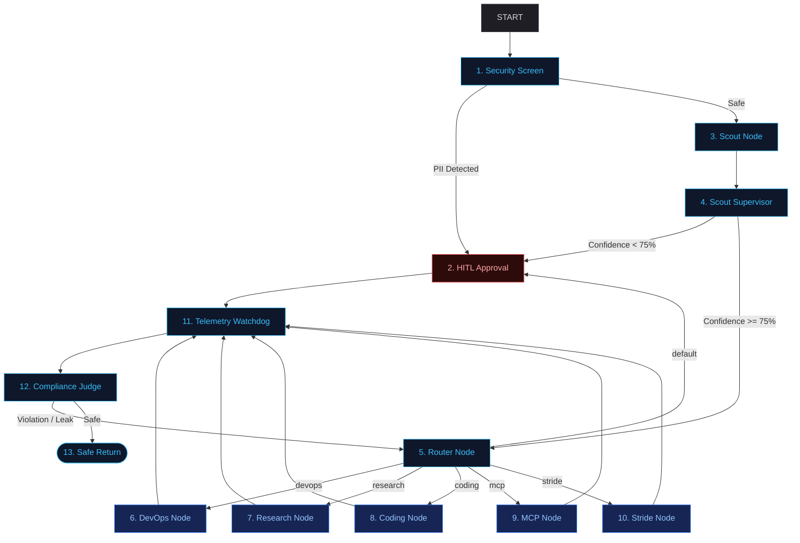
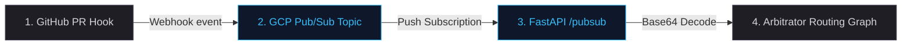

# System Architecture Blueprint
### Graph Topology, Routing Flows, and Active Supervisor Nodes

The Capability Arbitrator is designed around a **Scout-and-Execute** workflow. This blueprint outlines the active nodes, routing edges, and governance controllers that make up our multi-agent network.

---

## 📐 The Progressive Disclosure Pattern

To solve the **Context Rot** crisis (where agents are overloaded with hundreds of irrelevant instructions and tools), our architecture breaks execution into two stages:
1. **Understanding (Intent Classification):** A lightweight, low-latency **Scout** node inspects the user prompt and assigns a capability tag.
2. **Execution (Task Solving):** The request is routed to a specialized node. The specific Agent Skill (`SKILL.md`) and tools (such as MCP connections) are loaded into memory *only* at the moment of execution.

---

## 🗺️ System Workflow Diagram

The flowchart below represents the flow of a user transaction through our security, classification, routing, and verification layers:

---

## 📡 Ambient Event-Driven Pipeline

To support background operations (such as automated pull request triage), the system can be triggered ambiently via Google Cloud Pub/Sub:

---

## 🎛️ Node Topology Directory

Our graph contains thirteen distinct execution and monitoring nodes:

### 1. Inbound Filtration
*   **Security Screen (1):** A pre-LLM regex filtration layer. It intercepts user inputs to check for GDPR-scoped PII (SSNs, emails, phone numbers, credit cards, IP addresses), routing violations immediately to human approval.
*   **HITL Approval (2):** A blocking human-in-the-loop gate utilizing ADK `RequestInput` hooks. It pauses the workflow, alerts the dashboard manager, and waits for a manual override response.

### 2. Intent Classification
*   **Scout Node (3):** Powered by the lightweight `gemini-3.5-flash` model. It classifies user prompts into capability tags using a structured JSON schema.
*   **Scout Supervisor (4):** Reviews classification confidence metrics. If the routing model outputs a confidence score under 75%, the request is escalated to the Approval Node.
*   **Router Node (5):** Evaluates the tag and forwards the prompt context along the correct execution edge.

### 3. Specialized Execution Nodes
*   **DevOps Node (6):** A deterministic execution target. It runs local bash commands, tests (via `pytest`), or checkers via subprocesses.
*   **Research Node (7):** A specialized `LlmAgent` loaded with academic literature-searching instructions and few-shot formatting patterns.
*   **Coding Node (8):** An `LlmAgent` bound to an MCP filesystem tool, permitting file generation and refactoring in the local workspace.
*   **MCP Node (9):** A tool-enabled agent focused on filesystem search, file list retrieval, and file index matching.
*   **Stride Node (10):** A security threat modeling agent that maps architectural components to security threats.

### 4. Outbound Quality & Guardrails
*   **Telemetry Watchdog (11):** Think of this like a helpful watchdog that monitors how much time and money our agent is spending. At the end of every execution, it checks two conditions:
    1. **Cumulative Session Tokens:** The total words/tokens processed in this chat session. If it exceeds **10,000 tokens**, the context is getting too large.
    2. **Elapsed Duration (Latency):** How long the execution took. If it exceeds **30 seconds**, it is taking too long.
    
    If either budget is exceeded, the watchdog takes two corrective actions:
    - **Context Pruning (Summarizing):** It asks Gemini to summarize the conversation history and replaces the long history with a single concise summary so that subsequent turns don't run out of memory.
    - **Model Switching:** It switches the downstream model configuration to a cheaper/faster model (`gemini-2.0-flash-lite`) for the remainder of the session to save costs.
*   **Compliance Judge (12):** Reviews output text for security risks (e.g. API keys generated in code blocks) and checks factual grounding before sending the response back to the user.

---

## ⚙️ Execution Spectrum: Runtime vs. Evals

To manage a production agentic system, we segment our workloads into four distinct execution environments:

| Spectrum | Stage | Scope | Key Tooling |
| :--- | :--- | :--- | :--- |
| **Runtime Execution** | Production | Real-time user transaction handling, PII filtering, and capability routing | ADK 2.0 Graph, `FastAPI` |
| **CI/CD Gates** | Build-Time | Checks pre-commit/pre-push changes for style limits and code regressions | Git hooks, `agent_quality_check.py` |
| **Runtime Evaluation** | Testing / Validation | Dynamic red-teaming and automated LLM-as-a-judge scorecards | `DeepTester`, `OutcomeJudge` |
| **Development-Only** | Local Iteration | Interactive command-line prompts and playground visualizers | `agents-cli playground` |
