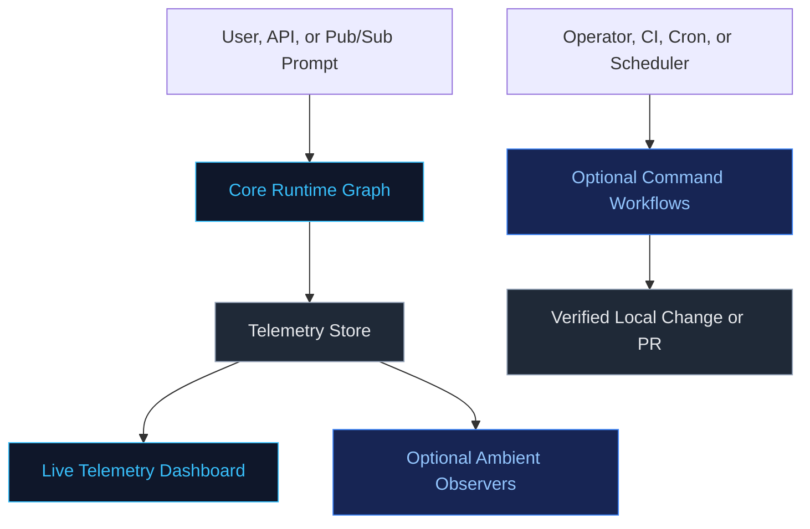
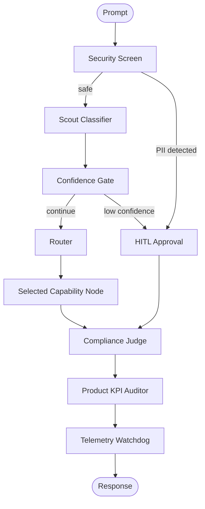

# System Architecture
### Capability Routing, Governance, Telemetry, and Opt-In Improvement Loops

The Capability Arbitrator is an ADK-based orchestration prototype for routing agent work to the smallest appropriate capability, applying governance gates, and recording execution telemetry. The core runtime graph handles user transactions. Separate opt-in improvement surfaces can review telemetry or source files and suggest changes.

This document is the architecture map. Use the linked reference docs for deeper implementation details.

---

## Architecture at a Glance

The main boundary is simple: **the runtime graph serves user requests; improvement surfaces are opt-in operational workflows around that graph.**

---

## Primary Boundaries

| Area | What It Is | Runs Automatically? | Can Write Files or Open PRs Today? | Details |
| :--- | :--- | :--- | :--- | :--- |
| Core runtime graph | The live ADK workflow in [`app/agent.py`](../app/agent.py) | Yes, for every graph invocation | No | [Core Runtime Graph](CORE_RUNTIME_GRAPH.md) |
| STRIDE/Flywheel command surface | Explicit CLI commands run by an operator, CI job, cron job, or scheduler | No, command must be invoked | Yes, when enabled and mode allows it | [Improvement Surfaces](IMPROVEMENT_SURFACES.md) |
| STRIDE/Flywheel ambient surface | Experimental event-driven observer called after `save_run()` | Yes, but only while the app process is running and telemetry is saved | No, current implementation observes and logs only | [Improvement Surfaces](IMPROVEMENT_SURFACES.md) |
| Pub/Sub ingress | FastAPI endpoint that converts an event payload into a graph run | Yes, when an external service posts to `/pubsub` | No, it only starts the core graph | [Ambient Triggers](AMBIENT_TRIGGERS.md) |

In Google-style ambient-agent language, "ambient" means the system reacts to events in the background instead of waiting for a direct user prompt. In this repository, ambient means **event-driven observation inside the running app process**. It is not a separate continuously running daemon.

---

## Document Map

| Read This | For This Question |
| :--- | :--- |
| [Core Runtime Graph](CORE_RUNTIME_GRAPH.md) | How does a user request move through security screening, Scout classification, routing, compliance checks, KPI audit, and the watchdog? |
| [Improvement Surfaces](IMPROVEMENT_SURFACES.md) | How do STRIDE Self-Healing and Quality Flywheel work in command mode versus ambient mode? |
| [Ambient Triggers](AMBIENT_TRIGGERS.md) | How does `/pubsub` receive an external event and start a normal graph run? |
| [Outcomes](OUTCOMES.md) | What metrics are currently tracked, and which claims are measured, estimated, or experimental? |
| [Security](SECURITY.md) | How do PII detection, HITL escalation, STRIDE analysis, and self-healing safety gates work? |
| [Deployment](DEPLOYMENT.md) | How should the system be configured for local, Docker, and deployable environments? |

---

## Core Runtime Summary

The graph constructs available nodes and toolsets at startup. For each request, only the selected routed branch executes. See [Core Runtime Graph](CORE_RUNTIME_GRAPH.md) for the full graph and component inventory.

---

## Improvement Surface Summary

STRIDE Self-Healing and Quality Flywheel each have two usage surfaces:

| Surface | How It Starts | What It Does Today |
| :--- | :--- | :--- |
| Command mode | `uv run arbitrator stride-heal <file>` or `uv run arbitrator flywheel` | Can audit, write, verify, and open PRs when explicitly enabled. |
| Ambient mode | `save_run()` calls the ambient observer after telemetry is persisted | Observes and logs signals only. It does not patch, write few-shots, validate changes, or open PRs today. |

Plain-English rule: **use command mode when you want repository changes; use ambient mode when you want the running app to notice and log signals after normal agent runs.**

See [Improvement Surfaces](IMPROVEMENT_SURFACES.md) for the enablement flags, command diagrams, ambient observer diagram, and current limitations.

---

## Runtime Surfaces

| Surface | Command | URL / Effect |
| :--- | :--- | :--- |
| ADK playground | `agents-cli playground` | `http://127.0.0.1:8080/dev-ui` |
| Standalone dashboard | `uv run arbitrator dashboard` | `http://127.0.0.1:8000/` |
| Unified FastAPI service | `uv run uvicorn app.fast_api_app:app --host 127.0.0.1 --port 8000` | `/`, `/dashboard`, `/api/run`, `/api/metrics`, `/pubsub` |
| STRIDE command mode | `uv run arbitrator stride-heal <file>` | Offline audit/patch/verify/PR path when enabled. |
| Flywheel command mode | `uv run arbitrator flywheel` | Offline telemetry improvement path when enabled. |

In the unified FastAPI service, `/` is the ADK web UI root and `/dashboard` is the custom telemetry dashboard. In the standalone dashboard app, `/` is the custom telemetry dashboard.

---

## Current Implementation Boundaries

| Area | Boundary |
| :--- | :--- |
| Ambient mode | Observes and logs only; it does not currently perform the CLI write/patch/PR workflows. |
| STRIDE ambient target selection | Requires `target_file` in telemetry; most normal graph runs do not currently populate that field. |
| Pub/Sub | `/pubsub` decodes a prompt and starts the core graph. It does not parse GitHub pull-request diffs by itself. |
| Flywheel mode label | `QUALITY_FLYWHEEL_MODE` is loaded by config, but the current CLI path does not branch on `observe_only`, `optimize`, or `open_pr`. |
| Telemetry storage | Uses local `telemetry_db.json`; production storage would need a managed data store and audit policy. |
| Token savings | Monolithic comparison is a baseline estimate, not a measured cloud bill. |
