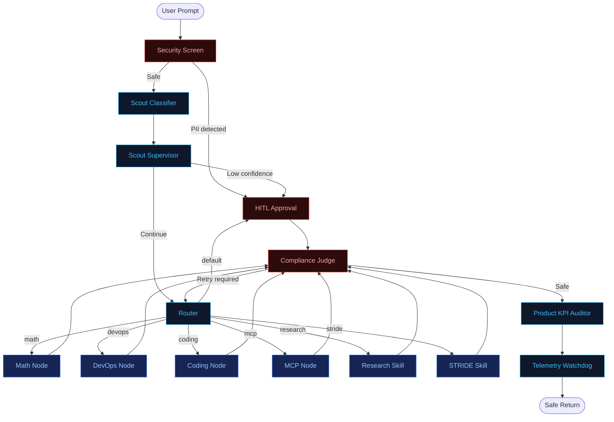

# Core Runtime Graph
### Request Routing, Governance Gates, and Telemetry

This document explains the live ADK graph that handles user-facing arbitrator requests. It covers the runtime path only. STRIDE Self-Healing, Quality Flywheel, and ambient observers are operational improvement surfaces documented in [Improvement Surfaces](IMPROVEMENT_SURFACES.md).

---

## Purpose

The core graph handles direct user transactions:

1. Screen the input for configured PII patterns.
2. Classify the request with the Scout model.
3. Gate low-confidence routing decisions.
4. Route to one capability branch.
5. Check the output for compliance issues.
6. Record KPI outcomes and telemetry.
7. Enforce runtime budget behavior through the watchdog.

The implementation lives in [`app/agent.py`](../app/agent.py).

---

## Runtime Flow

The graph constructs available nodes and toolsets at startup. For each request, only the selected routed branch executes.

---

## Runtime Behavior

| Step | Component | What It Does |
| :--- | :--- | :--- |
| 1 | Security Screen | Detects configured PII patterns and routes matches to approval before Scout execution. |
| 2 | Scout Classifier | Uses the configured model in [`app/config.py`](../app/config.py) to produce a capability tag and confidence score. |
| 3 | Scout Supervisor | Sends low-confidence Scout decisions to human approval. |
| 4 | Router | Sends the request to one execution branch. |
| 5 | Execution Node | Runs deterministic code, an MCP-backed node, or an LLM skill. |
| 6 | Compliance Judge | Scans output for secret-like values and can retry through the Router with a rewrite prompt. |
| 7 | Product KPI Auditor | Writes outcome verdicts and violations into telemetry. |
| 8 | Telemetry Watchdog | Can summarize oversized session history and switch the shared model to a cheaper fallback. |

---

## Component Inventory

| Component | Type | Source |
| :--- | :--- | :--- |
| Core graph | ADK `Workflow` | [`app/agent.py`](../app/agent.py) |
| Security Screen | Deterministic graph node | [`app/agent.py`](../app/agent.py) |
| Scout | Classifier `FunctionNode` | [`app/app_utils/scout_utils.py`](../app/app_utils/scout_utils.py) |
| Scout Supervisor | Confidence gate `FunctionNode` | [`app/app_utils/scout_supervisor_utils.py`](../app/app_utils/scout_supervisor_utils.py) |
| Router | Runtime branch selector | [`app/agent.py`](../app/agent.py) |
| Math Node | Deterministic execution branch | [`app/app_utils/math_utils.py`](../app/app_utils/math_utils.py) |
| DevOps Node | Deterministic execution branch | [`app/app_utils/devops_utils.py`](../app/app_utils/devops_utils.py) |
| Coding Node | LLM execution branch | [`app/agent.py`](../app/agent.py) |
| MCP Node | MCP-backed execution branch | [`app/agent.py`](../app/agent.py) |
| Research Node | Skill-backed execution branch | [`app/agent.py`](../app/agent.py) |
| STRIDE Node | Skill-backed execution branch | [`app/agent.py`](../app/agent.py), [`app/skills/stride/SKILL.md`](../app/skills/stride/SKILL.md) |
| Compliance Judge | Output safety `FunctionNode` | [`app/app_utils/compliance_judge_utils.py`](../app/app_utils/compliance_judge_utils.py) |
| Product KPI Auditor | Runtime KPI `FunctionNode` | [`app/app_utils/product_agent_utils.py`](../app/app_utils/product_agent_utils.py) |
| Telemetry Watchdog | Runtime budget `FunctionNode` | [`app/app_utils/watchdog_utils.py`](../app/app_utils/watchdog_utils.py) |
| Telemetry store | Local JSON telemetry | [`app/app_utils/telemetry.py`](../app/app_utils/telemetry.py) |

---

## What This Graph Is Not

The core graph is not the same thing as the improvement loops.

| Not Part of the Core Graph | Where It Lives |
| :--- | :--- |
| STRIDE patch generation, verification, and PR creation | CLI command surface in [`app/cli.py`](../app/cli.py) and [`patch_agent_utils.py`](../app/app_utils/patch_agent_utils.py) |
| Quality Flywheel few-shot generation, validation, and PR creation | CLI command surface in [`app/cli.py`](../app/cli.py) and [`flywheel_utils.py`](../app/app_utils/flywheel_utils.py) |
| Telemetry-based ambient observers | Post-telemetry hook in [`ambient_supervisor.py`](../app/app_utils/ambient_supervisor.py) |
| Pub/Sub event ingress | FastAPI endpoint in [`app/fast_api_app.py`](../app/fast_api_app.py) |
