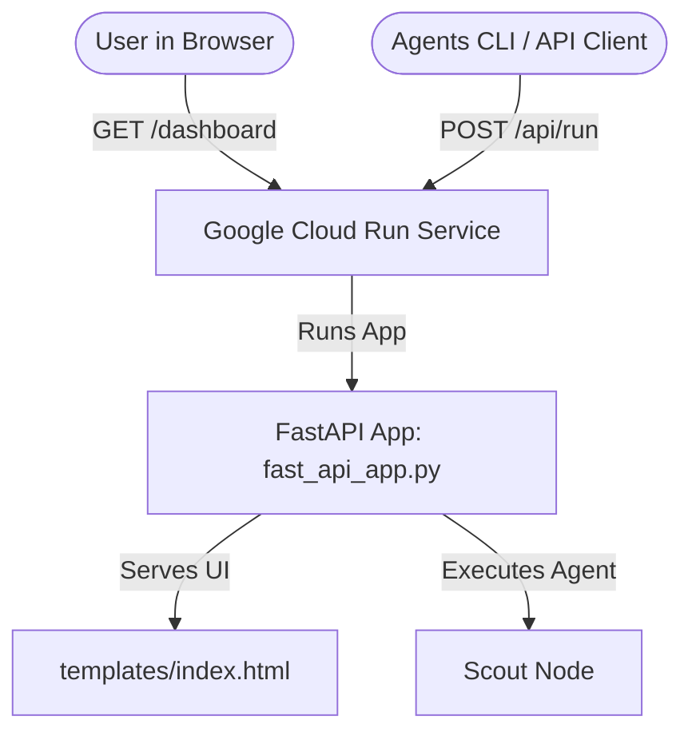

# Unified Deployment Guide: Dashboard & Agent API

This guide explains how to deploy the Capability Arbitrator and its visual telemetry dashboard together in a single deployment on Google Cloud.

---

## 1. Why: The Problem & The Vision
* **The Problem:** Traditionally, deploying an AI agent means hosting the "brain" (the backend model/orchestration API) in one place, and the "body" (the user interface/telemetry dashboard) in another. Managing two URLs, setting up cross-origin permissions (CORS), and keeping them in sync is a headache.
* **The Solution:** We unify them! By packaging both the agent's execution engine and the visual dashboard into a single FastAPI app, we can deploy a single container. A single URL serves the gorgeous web dashboard to humans and the execution API to terminal tools.

---

## 2. What: The Architecture
The unified setup is a containerized web application built with:
1. **The Backend API (`app/fast_api_app.py`):** Exposes standard ADK endpoints for the `agents-cli` to query, evaluate, and stream results.
2. **The Dashboard (`/dashboard`):** Exposes a visual page showing costs, latency, and routing stats. It reads historical data from a lightweight database (`app/telemetry_db.json`) and streams agent queries to the backend.
3. **The Deployment Target (Google Cloud Run):** Runs the container on demand, auto-scaling down to zero when idle to save money.



---

## 3. How: Step-by-Step Guide

### Step A: Run and Test Locally
Before pushing to the cloud, make sure everything works on your machine:
```bash
# Start the unified FastAPI server
uv run uvicorn app.fast_api_app:app --host 127.0.0.1 --port 8000
```
* **To view the Dashboard:** Open your browser to `http://127.0.0.1:8000/dashboard`
* **To view the ADK Test Page:** Open `http://127.0.0.1:8000/`

### Step B: Enhance Scaffolding for Cloud Run
To generate the required container configuration (`Dockerfile` and Terraform infrastructure templates), tell the CLI to use Cloud Run:
```bash
agents-cli scaffold enhance --deployment-target cloud_run
```

### Step C: Provision Cloud Resources (First Time Only)
Create the Google Cloud service accounts, permissions, and log storage buckets needed:
```bash
agents-cli infra single-project
```

### Step D: Deploy to Google Cloud Run
Deploy the unified container:
```bash
agents-cli deploy
```
Once deployment finishes, the CLI will output your service URL (e.g., `https://capability-arbitrator-xyz.a.run.app`).
* **Open `https://<your-service-url>/dashboard`** in your browser to view your live cloud telemetry dashboard.
* **Run CLI commands** directly against it:
  ```bash
  agents-cli run --url https://<your-service-url> --mode adk "your prompt"
  ```

---

## 4. When to Use This Setup
* **Use Cloud Run (This Unified Setup) when:**
  * You want a simple "all-in-one" URL that serves the visual playground dashboard and handles API requests.
  * You want to save costs by scaling the web frontend and agent executor down to zero when no one is using them.
* **Use Agent Runtime (Reasoning Engine) only when:**
  * You need a headless agent service with no user interface.
  * You are integrating the agent strictly as a background microservice in a larger pre-existing application.
