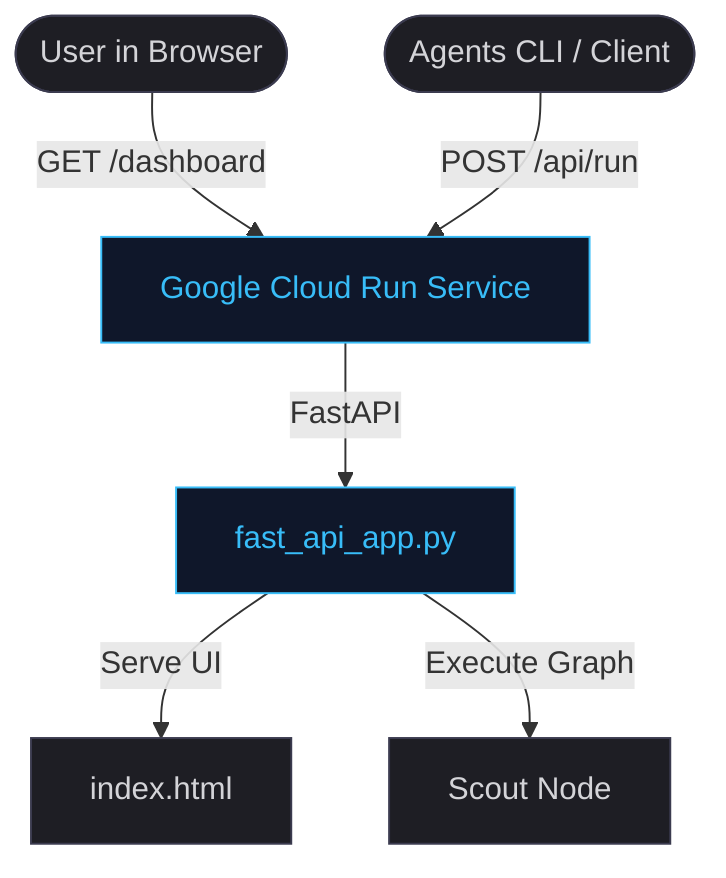

# Cloud Deployment Guide
### Containerizing and Deploying the Telemetry Dashboard & Agent API

This guide outlines how to package and deploy the Capability Arbitrator and its visual dashboard to Google Cloud.

---

## ⚡ Unified Container Architecture

* **The Problem:** Traditionally, agent deployments split the agent's execution API from its user interface. Managing CORS headers, service accounts, and multiple cloud URLs is an operational headache.
* **The Solution:** We package the FastAPI telemetry dashboard and the ADK Agent API into a single Docker container. A single Cloud Run service handles both visual dashboard monitoring for developers and API runtimes for CLI clients.



---

## 🚀 Deployment Instructions

### Step 1: Validate Locally
Before deploying, verify that the unified app runs locally on your machine:
```bash
uv run uvicorn app.fast_api_app:app --host 127.0.0.1 --port 8000
```
* **Dashboard Portal:** Open `http://127.0.0.1:8000/dashboard` in your browser.
* **API Portal:** Open `http://127.0.0.1:8000/` to test endpoint responses.

### Step 2: Initialize Infrastructure Scaffolding
Generate the standard container configurations and Terraform templates required for Google Cloud:
```bash
agents-cli scaffold enhance --deployment-target cloud_run
```

### Step 3: Provision Cloud IAM Policies
Provision the necessary service accounts, API access permissions, and log storage buckets in your GCP project:
```bash
agents-cli infra single-project
```

### Step 4: Build and Deploy to Cloud Run
Build the container image and deploy it live to Google Cloud Run:
```bash
agents-cli deploy
```

> [!NOTE]
> Upon completion, the CLI will output your live URL (e.g. `https://capability-arbitrator-xyz.a.run.app`). Append `/dashboard` to view the live developer telemetry console.

---

## 🎯 Deployment Configuration Matrix

| Target Option | Purpose | Use-Case | Key Metrics |
| :--- | :--- | :--- | :--- |
| **Google Cloud Run (Unified)** | Runs web frontend + agent execution API in one container | Default option for developers needing visual HUDs and API access | Latency, Request count, Container health |
| **Agent Runtime (Reasoning Engine)** | Headless, model-managed orchestration layer | Backend-only integrations or microservice deployments | Execution latency, Prompt token count |

---

## 💰 Resource & Scaling Optimization

> [!TIP]
> **Scale-to-Zero Billing:** By deploying to Google Cloud Run, instances scale down to 0 when idle. This completely eliminates idle compute charges, significantly reducing operations cost for internal developer tools.
