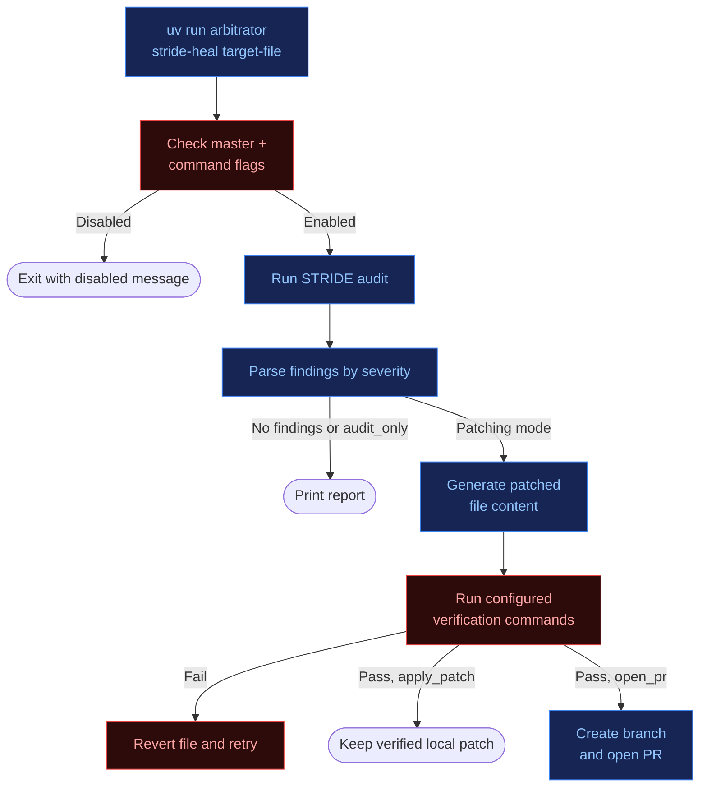
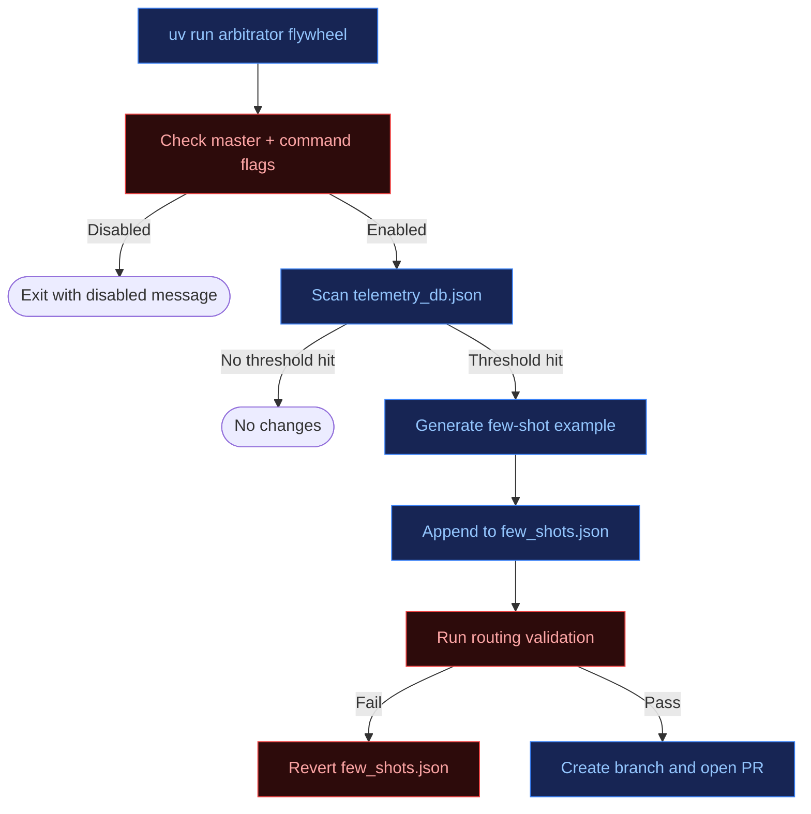
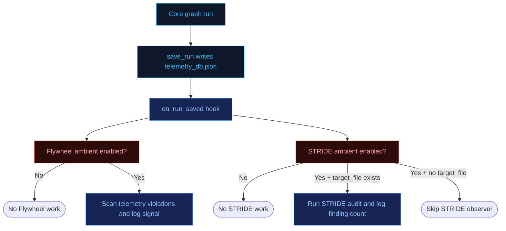

# Improvement Surfaces
### STRIDE Self-Healing, Quality Flywheel, and Ambient Observers

This document explains the optional improvement workflows around the core arbitrator graph. These workflows are disabled by default and are separate from normal user request routing.

The short version:

| Surface | How It Starts | Current Behavior |
| :--- | :--- | :--- |
| Command mode | An operator, CI job, cron job, or scheduler explicitly runs a CLI command. | Can audit, write, verify, and open PRs when enabled. |
| Ambient mode | The running app calls an observer after `save_run()` persists telemetry. | Observes and logs signals only. It does not write files or open PRs today. |

Plain-English rule: **use command mode when you want repository changes; use ambient mode when you want the running app to notice and log signals after normal agent runs.**

---

## Why This Is Separate From the Core Graph

The core graph serves user requests. It screens input, classifies intent, routes to a capability, checks output, writes telemetry, and returns a response.

STRIDE Self-Healing and Quality Flywheel are improvement surfaces. They inspect either source files or telemetry and can help improve the system over time. They should not be described as normal request execution unless they are being invoked through the STRIDE skill branch for a user-requested analysis.

| Capability | Core Graph Role | Improvement Surface Role |
| :--- | :--- | :--- |
| STRIDE | A routed skill can perform threat-model analysis when the user asks for it. | The self-healing CLI can audit a target file, propose or apply a patch, verify it, and open a PR when enabled. |
| Quality Flywheel | Not a runtime graph node. Runtime telemetry supplies its input data. | The CLI can turn repeated routing or outcome failures into validated few-shot updates when enabled. |
| Ambient Supervisor | Not a standalone graph node. | A post-telemetry hook that observes/logs signals after runs when enabled. |

---

## Enablement Model

Each improvement feature has three control layers.

| Layer | STRIDE Env Var | Flywheel Env Var | Meaning |
| :--- | :--- | :--- | :--- |
| Master | `STRIDE_SELF_HEALING_ENABLED` | `QUALITY_FLYWHEEL_ENABLED` | If false, the feature is a no-op. |
| Command surface | `STRIDE_SELF_HEALING_ARBITRATOR_ENABLED` | `QUALITY_FLYWHEEL_ARBITRATOR_ENABLED` | Controls explicit CLI commands. If false, CLI invocation exits with a disabled message. |
| Ambient surface | `STRIDE_SELF_HEALING_AMBIENT_ENABLED` | `QUALITY_FLYWHEEL_AMBIENT_ENABLED` | Controls post-telemetry observers. If false, `save_run()` still completes, but observers do no work. |
| Mode label | `STRIDE_SELF_HEALING_MODE` | `QUALITY_FLYWHEEL_MODE` | Controls STRIDE CLI behavior. Flywheel mode is currently a label for experimental surfaces; CLI behavior is full write/validate/PR when enabled and triggered. |

Default values live in `.env.example`, [`config/stride_self_healing.yaml`](../config/stride_self_healing.yaml), and [`config/quality_flywheel.yaml`](../config/quality_flywheel.yaml). Both features are disabled by default.

---

## Command Mode

Command mode is the mutating path. It is intended for intentional local runs, CI, cron, or a scheduler.

### STRIDE Self-Healing CLI

The STRIDE command audits a target file, parses findings, and can escalate from report-only to patch-and-PR.



Common commands:

```bash
uv run arbitrator stride-heal app/agent.py --mode audit_only
uv run arbitrator stride-heal app/agent.py --mode apply_patch
STRIDE_SELF_HEALING_MODE=open_pr uv run arbitrator stride-heal app/agent.py
```

Current implementation details:

- `audit_only` prints the STRIDE report and does not write files.
- `propose_patch`, `apply_patch`, and `open_pr` currently enter the patch-and-verify loop.
- Verification failure restores the original file.
- `open_pr` uses local git and the authenticated `gh` CLI.

### Quality Flywheel CLI

The Flywheel command reviews telemetry violations, writes one new few-shot example for a supported skill, validates routing, and opens a PR.



Common commands:

```bash
uv run arbitrator flywheel
uv run arbitrator flywheel --dry-run
```

Current implementation details:

- The CLI checks `QUALITY_FLYWHEEL_ENABLED` and `QUALITY_FLYWHEEL_ARBITRATOR_ENABLED`.
- When enabled and triggered, the CLI performs the write, validate, and PR path.
- `--dry-run` prints the intended action and does not write files.
- Optimizable tags are currently defined in [`flywheel_utils.py`](../app/app_utils/flywheel_utils.py): `stride` and `researcher`.

---

## Ambient Mode

In Google-style ambient-agent language, "ambient" means the system reacts to events in the background instead of waiting for a direct user prompt.

In this repository, ambient means **event-driven observation inside the running app process**. It is not a separate continuously running daemon. The observer only runs after a normal graph run reaches `save_run()`.

### Ambient Observer Flow



Ambient surface is implemented in [`app/app_utils/ambient_supervisor.py`](../app/app_utils/ambient_supervisor.py). It is called by [`save_run()`](../app/app_utils/telemetry.py) after telemetry is persisted.

### What Ambient Mode Does Today

| Observer | Current Behavior | Current Limits |
| :--- | :--- | :--- |
| Quality Flywheel ambient observer | Scans telemetry for routing-confidence violations and logs triggered tags. | Does not generate few-shots, write files, validate, or open PRs. |
| STRIDE ambient observer | For `coding` or `stride` runs with a valid `target_file`, runs a STRIDE audit and logs finding count. | Current telemetry usually does not include `target_file`; does not patch, verify, or open PRs. |

### Operational Requirements

- The app or agent process must be running.
- Telemetry must be saved through `save_run()`.
- Master and ambient flags must both be enabled.
- Ambient errors are caught and logged so they do not block the user transaction.

This is why it is accurate to call the current ambient surface **event-driven observation**, not a standalone continuous daemon and not a mutating self-healing worker.

---

## Current Limitations

| Area | Limitation |
| :--- | :--- |
| Ambient mode | Observes and logs only; it does not currently perform the CLI write/patch/PR workflows. |
| STRIDE ambient target selection | Requires `target_file` in telemetry; most normal graph runs do not currently populate that field. |
| Flywheel mode label | `QUALITY_FLYWHEEL_MODE` is loaded by config, but the current CLI path does not branch on `observe_only`, `optimize`, or `open_pr`. |
| GitHub credentials | PR creation depends on local git state and an authenticated `gh` CLI. |
| Safety posture | Mutating workflows should be treated as experimental and run with review before merge. |
