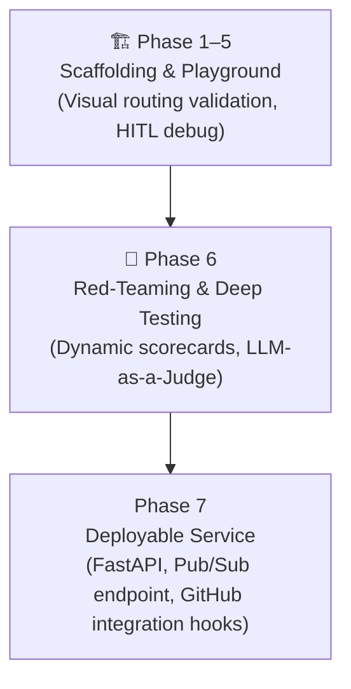

# Product Strategy & Technical Vision
### Capability-Scoped Execution With Measurable Governance

This document outlines the strategic decisions, architectural milestones, and alignment patterns behind the Capability Arbitrator.

---

## 1. Core Thesis: Capability Resolution

Many agent systems ask: *"Which model should answer this prompt?"*

The Capability Arbitrator asks: ***"What capability is required, and what governance should surround it?"***

Capability Resolution means deciding whether a task should be handled by an LLM skill, a deterministic script, an MCP-backed tool, a human approval gate, or an offline optimization workflow.

The differentiated part is not routing alone. It is routing plus confidence gates, deterministic offload, telemetry provenance, output compliance and outcome checks in one lifecycle.

---

## 2. Progressive Disclosure vs. Prompt Bloat

Traditional agents often attach many instructions and tools to every request. This increases cost, makes behavior harder to audit and can make routing decisions harder to explain.

By applying **Progressive Disclosure**, the Scout first classifies the request using the configured model in `app/config.py`. The Router then sends the request to the selected execution branch. The implementation constructs available nodes and tools at startup, but only the selected branch executes for the request.

### Trade-Off
* **The Downside:** The Scout adds an extra classification step before execution.
* **The Upside:** The system records why a branch was selected, can pause uncertain decisions and can route deterministic work away from LLM execution.

---

## 3. Strategic Roadmap and Milestones

The project is structured into three primary architectural stages:



### Milestone Breakdown:
1. **Milestone A (Scaffolding & Playground):** Visual graph debugging and human-in-the-loop pause/resume validation using the ADK Dev UI.
2. **Milestone B (Red-Teaming & Testing):** Running programmatically simulated developer prompts and grading outcomes using an LLM-as-a-Judge.
3. **Milestone C (Deployment Integration):** Running the arbitrator behind FastAPI, exposing Pub/Sub and dashboard endpoints, and adding repository-specific GitHub wiring where needed.

---

## 4. Alignment with Systems Engineering

This architecture is the culmination of systems-thinking principles applied to AI orchestration:
* **Capability-scoped execution:** Route each request to a narrow execution branch.
* **Governance gates:** Escalate PII, dangerous actions and low-confidence routing decisions.
* **Telemetry provenance:** Mark whether tokens are measured, deterministic zero, or estimated.
* **Budget governance:** Monitor token and latency budgets and record outcome violations.

---

## 5. Opt-In Self-Healing DevSecOps (Issue #16)

The long-term target for the Capability Arbitrator is a controlled self-healing security workflow: an operator or approved automation can audit a code path for vulnerabilities, generate a targeted fix, verify it against the test suite, and open a pull request for review.

### Why this matters
Most security tooling is passive: it scans, reports, and stops. Developers must still triage the report, write the patch, run tests, and submit a PR. The self-healing workflow reduces that handoff while preserving explicit enablement, verification, and review gates.

### Escalating Autonomy Ladder
The feature is designed with a conservative four-stage ladder so teams can adopt it incrementally:

| Mode | What it does | Human still needed for |
| :--- | :--- | :--- |
| `audit_only` | Runs STRIDE analysis, prints the report | Everything |
| `propose_patch` | Generates and prints the suggested patch | Review + apply |
| `apply_patch` | Writes the patch and runs pytest | Review + PR creation |
| `open_pr` | Full pipeline — patch, verify, git branch, PR | Code review before merge |

### Safety Gates
* **Disabled by default.** `STRIDE_SELF_HEALING_ENABLED=false` in `.env.example`. No LLM calls, no file writes without opt-in.
* **GitHub token required** only for `open_pr` mode — local modes never need credentials.
* **No reading `.env` files.** The `patch_agent` skill explicitly prohibits referencing secret files.
* **Revert on failure.** If pytest fails after a patch is written, the file is restored before exit.
* **Manual review gate.** `require_manual_review: true` in config blocks silent merges.

### CLI Trigger
```bash
uv run arbitrator stride-heal app/agent.py                         # audit_only (default)
uv run arbitrator stride-heal app/agent.py --mode apply_patch      # write + verify
STRIDE_SELF_HEALING_MODE=open_pr uv run arbitrator stride-heal app/agent.py  # full pipeline
```

Implementation: [`app/app_utils/patch_agent_utils.py`](../app/app_utils/patch_agent_utils.py), [`app/skills/patch_agent/SKILL.md`](../app/skills/patch_agent/SKILL.md), config: [`config/stride_self_healing.yaml`](../config/stride_self_healing.yaml).
