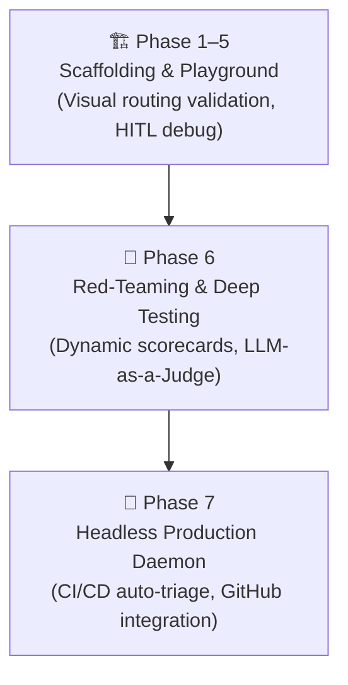

# Product Strategy & Technical Vision
### Decoupling Agent Intelligence from Execution Infrastructure

This document outlines the strategic decisions, architectural milestones, and alignment patterns behind the Capability Arbitrator.

---

## ⚡ 1. The Core Innovation: "Capability Resolution"

Most agentic orchestrators ask: *"Which LLM model should answer this prompt?"* 

The Capability Arbitrator shifts the focus to: ***"What capability is required to solve this problem?"***

The true whitespace in modern AI architecture is not model size or raw intelligence, but **Capability Resolution**—the ability to decide at runtime whether a task is best solved by a Model, an external API, an MCP tool, a deterministic script, or a human administrator.

---

## ⚡ 2. Progressive Disclosure vs. Prompt Bloat

Traditional agents load all instructions and tools at startup. This causes **Prompt Bloat**, leading to high latency and cognitive degradation. 

By applying **Progressive Disclosure**, we load a fast classification Scout node (`gemini-3.5-flash`) to identify the required capability. We then break the context cache, clear the model's memory, and load *only* the specific tools and rules needed for that task.

### The "Cache Break" Trade-Off
* **The Downside:** Clearing the context cache causes a minor latency delay (sub-second) as the model loads new specialized instructions.
* **The Upside:** The model operates with absolute precision, avoiding hallucinations and utilizing a fraction of the token budget compared to monolithic architectures.

---

## ⚡ 3. Strategic Roadmap & Milestones

The project is structured into three primary architectural stages:

### Milestone Breakdown:
1. **Milestone A (Scaffolding & Playground):** Visual graph debugging and human-in-the-loop pause/resume validation using the ADK Dev UI.
2. **Milestone B (Red-Teaming & Testing):** Running programmatically simulated developer prompts and grading outcomes using an LLM-as-a-Judge.
3. **Milestone C (Production Integration):** Deploying the arbitrator as a background daemon wired directly to GitHub repositories to triage issues, review PRs, and run tests automatically.

---

## ⚡ 4. Alignment with Systems Engineering

This architecture is the culmination of systems-thinking principles applied to AI orchestration:
* **Context Engine:** Retrieve only the information necessary for the immediate query.
* **Progressive Loadouts:** Defer loading heavy resources until explicitly required.
* **Budget Governance:** Strictly monitor and control compute, token, and latency overhead at runtime.
