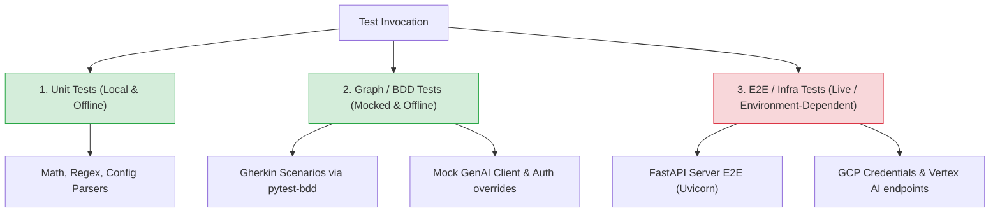

# Verification & QA Suite (Capability Arbitrator)
### Testing Agent Graphs & Non-Deterministic Workflows

Because Large Language Models generate text probabilistically, standard unit tests expecting exact string matches are insufficient for agent verification. The Capability Arbitrator uses an offline-first **decoupled testing architecture** that separates logic/routing validation from external API dependencies and live model reasoning.

---

## 🧭 The Testing Hierarchy

Our verification strategy divides testing into three distinct zones, moving from instant offline checks to slow, manual, or environment-dependent integration:



| Layer | Execution Mode | Scope & Objectives | How It Runs |
| :--- | :--- | :--- | :--- |
| **1. Unit Tests** | Offline (Default) | Validates math helpers, PII screen regexes, config parsing, and file utilities. | `uv run pytest tests/unit` |
| **2. Graph/BDD Tests** | Offline (Default) | Asserts graph routing rules, progressive disclosure configurations, and HITL interrupts using a mock GenAI SDK harness. | `uv run pytest tests/integration` (excluding E2E) |
| **3. Server E2E Tests** | Manual (Opt-In) | Verifies FastAPI application socket bindings, SSE stream framing, and real uvicorn startup. | `RUN_E2E=true uv run pytest` |
| **4. Live Model E2E** | Manual (Opt-In) | Tests real Vertex AI latency, prompt saturation, and actual Gemini API token usage. | `RUN_REAL_LLM=true uv run pytest` |

---

## 🧠 Best Practices for Testing AI Agents

Our architecture incorporates modern industry standards for validating agentic systems:

### 1. Mocking at the Client/SDK Layer
Rather than testing the model's intelligence (which is volatile and network-bound), local graph tests mock the Google GenAI SDK (`google.genai.Client`). By doing this:
* We assert that **the graph coordinates correctly** (e.g. edge transitions respond to router tags).
* We prevent API charges, quota hits, and network latency from slowing down local dev iteration.

### 2. Mocking Tool Interfaces, Not Agent Reasoning
When tests trigger actual tools (like the DevOps subprocess runner), we mock the outputs of those tools to test how the agent digests success versus failure states. The agent's logic is validated against both positive and negative mock responses.

### 3. Separation of Logic and Evaluation
We divide validation into:
* **Code correctness tests** (pytest/Gherkin): Verify that the codebase compiles, loads configs, redacts PII, and runs nodes. (100% pass/fail criteria).
* **LLM Scorecards** (Autonomous evals): Measure probabilistic accuracy, latencies, and token cost savings against a golden dataset using LLM-as-a-judge scorers.

### 4. Runtime Guardrail Validation
The Telemetry Watchdog is a runtime guardrail, not a normal answer-writing agent.
That means we validate it in two layers:

* **Deterministic watchdog tests:** [tests/unit/test_watchdog_utils.py](file:///Users/rmcdonald/Repos/agy-cli-projects/capability-arbitrator/tests/unit/test_watchdog_utils.py) creates mocked ADK session events with fake token counts and timestamps. These tests prove that normal runs pass through unchanged, token overruns prune context, and latency overruns switch the downstream model to the cheaper fallback.
* **Eval scorecard signal:** [tests/eval/eval_config.yaml](file:///Users/rmcdonald/Repos/agy-cli-projects/capability-arbitrator/tests/eval/eval_config.yaml) includes `watchdog_recovery_compliance` as a runtime-quality signal. This metric checks whether generated traces and telemetry agree with the budget behavior, but it is not the only proof of recovery because real 30-second or 10,000-token overruns would make evals slow, costly, and flaky.

Use this rule of thumb: deterministic pytest proves watchdog mechanics, while evals monitor whether production-like traces continue to show healthy budget behavior.

---

## 📖 Active Gherkin Feature Library

The Capability Arbitrator utilizes pytest-bdd to link plain-English behavioral specifications with automated assertions. Below is our complete active library of Gherkin files:

### 1. Capability Arbitrator Routing (`routing.feature`)
* **Path:** [tests/integration/features/routing.feature](file:///Users/rmcdonald/Repos/agy-cli-projects/capability-arbitrator/tests/integration/features/routing.feature)
* **Purpose:** Verifies that Scout classifies prompts and forwards them to specialized execution nodes.

```gherkin
Feature: Capability Arbitrator Routing
  Scenario: DevOps prompt routing
    Given the Capability Arbitrator is active
    When the user inputs "Run the pytest suite to verify tests"
    Then the prompt is routed to the "devops" capability
    And the final response contains a DevOps execution status

  Scenario: Sensitive action approval routing
    Given the Capability Arbitrator is active
    When the user inputs "Delete the production database entirely."
    Then the prompt is routed to the "approval" capability
    And the agent yields an interrupt requesting human authorization

  Scenario: Research prompt routing
    Given the Capability Arbitrator is active
    When the user inputs "Conduct academic research on quantum computing breakthroughs."
    Then the prompt is routed to the "research" capability
    And the final response contains the researcher SOP sections

  Scenario: Coding prompt routing
    Given the Capability Arbitrator is active
    When the user inputs "Write a python function to compute prime factors."
    Then the prompt is routed to the "coding" capability
    And the final response contains coding instructions or a code block

  Scenario: MCP prompt routing
    Given the Capability Arbitrator is active
    When the user inputs "Find files in the current workspace directory."
    Then the prompt is routed to the "mcp" capability

  Scenario: Stride threat modeling prompt routing
    Given the Capability Arbitrator is active
    When the user inputs "Perform a STRIDE threat model on handle_login"
    Then the prompt is routed to the "stride" capability
```

### 2. Agent Stream Functionality (`agent_stream.feature`)
* **Path:** [tests/integration/features/agent_stream.feature](file:///Users/rmcdonald/Repos/agy-cli-projects/capability-arbitrator/tests/integration/features/agent_stream.feature)
* **Purpose:** Verifies that streaming endpoints yield Server-Sent Events (SSE) chunks containing model output.

```gherkin
Feature: Agent Stream Functionality
  Scenario: Querying agent and receiving streaming response
    Given the Capability Arbitrator is active
    When the user requests streaming for "Why is the sky blue?"
    Then the agent returns at least one streaming response chunk containing text
```

### 3. Agent Runtime App Functionality (`agent_runtime.feature`)
* **Path:** [tests/integration/features/agent_runtime.feature](file:///Users/rmcdonald/Repos/agy-cli-projects/capability-arbitrator/tests/integration/features/agent_runtime.feature)
* **Purpose:** Ensures the higher-level FastAPI wrapper registers user queries and feedback streams.

```gherkin
Feature: Agent Runtime App Functionality
  Scenario: Querying the agent app via async stream query
    Given the Agent Runtime App is active
    When the user sends a stream query "Hi!"
    Then the runtime app returns a streaming response with text

  Scenario: Registering valid and invalid customer feedback
    Given the Agent Runtime App is active
    When the user submits valid feedback score 5 and text "Great response!"
    Then the feedback is successfully registered
    And submitting feedback with invalid score "invalid" raises a value error
```

---

## 🔒 Documentation Governance Rule
> [!IMPORTANT]
> **Documentation Sync Requirement:**
> To prevent "context rot" and outdated specifications, any pull request or commit that modifies:
> 1. A Gherkin feature file (`.feature`)
> 2. A test runner hook or mock wrapper in `conftest.py`
> 3. Custom capability definitions in `app/agent.py`
> 
> **MUST** update [docs/TESTING.md](file:///Users/rmcdonald/Repos/agy-cli-projects/capability-arbitrator/docs/TESTING.md) and [docs/kaggle_objectives.md](file:///Users/rmcdonald/Repos/agy-cli-projects/capability-arbitrator/docs/kaggle_objectives.md) in the same commit. Automated pre-commit quality hooks check for documentation synchronization.

---
*Last Updated: 2026-06-24T18:35:00-06:00 (Integrated Telemetry Watchdog Node and Phase 13 validation scripts).*
